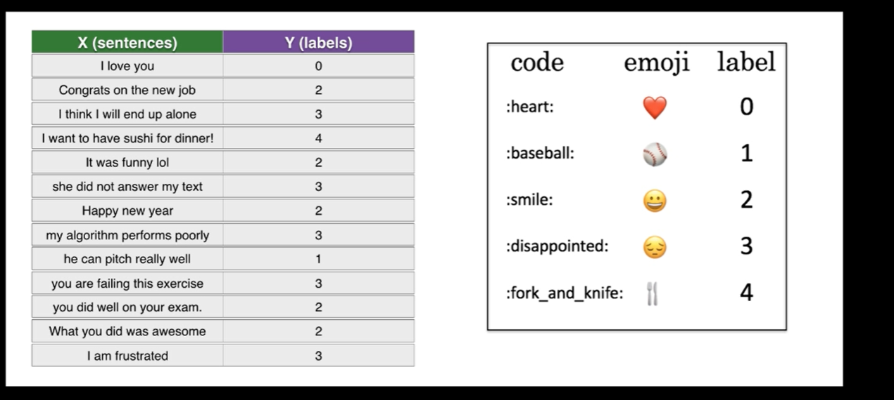

# Emoticon-prediction



## Dependencies
List of dependencies for running this application.
 * **Keras**
 * **tensorflow**
 * **Pandas**
 * **Numpy**
 * **Matplotlib**
 * **Emoji**

# Input
Text data consiting of different sentences along with the labels. Labels represent a particular emoji representing the sentence. 

- **test_emoji.csv** -  for testing our model
- **train_emoji.csv** - for training our model


# Algorithm's Used
-RNN<br>
-LSTM

**Emoji Prediction.ipynb**   
This python script contains the code for both the models and their predictions.

## How to use
1. Download or clone this repository.
2. Use  **```git clone https://github.com/mayanksharma019/Emoticon-prediction.git```**
3. Extract the repository to some location.
4. Run **```emoticon_prediction.ipynb```** and give your own text as input.
5. I have used the 6B 50D glove vector to build embedding matrix of words available in the glove vector.<br> Download the 6B.50.50d.txt file and extract the file in the same directory as that of the code.<br>
Downloading Link-> [glove.6B.50D.txt](https://www.kaggle.com/watts2/glove6b50dtxt)
